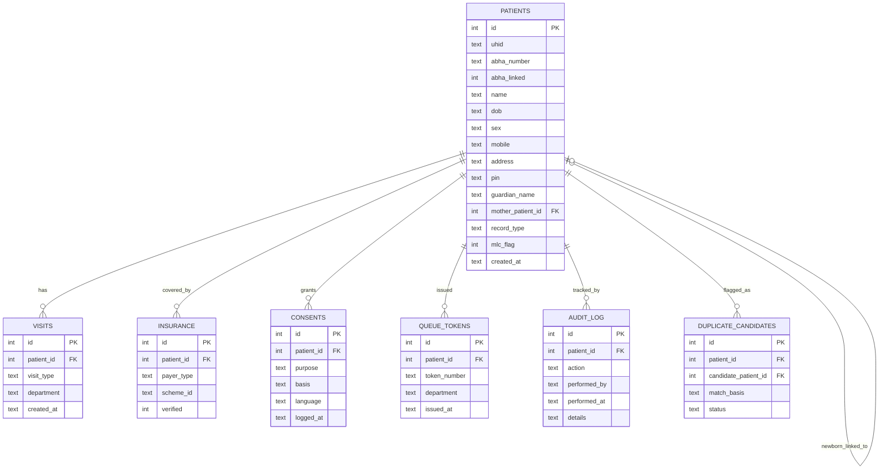

# PRD-01 — Phase-1 (M1) ERD

Scope: matches the Data Model Draft (§7) from `M1_Requirements_Signoff_Patient_Registration.docx` —
`patients`, `visits`, `insurance`, `consents`, `queue_tokens`, `audit_log`. Photo capture, SMS
delivery, offline mode, kiosk/self-registration, bulk API, and AI features are out of scope.

## Design notes
- `patients.mother_patient_id` is a self-referencing FK, used only when `record_type = 'newborn'` (user story 5's sibling requirement, FR-13) — enforced at the API layer today (write rejected if the referenced UHID doesn't exist).
- `duplicate_candidates` supports both user story 1 (search by UHID/ABHA/mobile) and user story 3 (duplicate warning before save): a row is created when a probable match is found, and `status` tracks whether the registrar dismissed it, confirmed a merge, or left it pending.
- `audit_log` exists as its own table (not inline history on `patients`) specifically so merge actions (user story 4) remain independently auditable even if a patient record is later modified — this satisfies the MRD officer's "complete audit trail for merged records" requirement.
- `insurance` maps directly to user story 6 (billing officer needs payer/policy details without re-entry) — `verified` is set by the PMJAY/BIS check where applicable.
- `queue_tokens` covers generation only, per the M1 scope note — SMS delivery of the token is explicitly out of scope for this milestone.
- Field-level detail for `patients` (mobile/PIN format, guardian requirement, etc.) mirrors the working prototype's validation rules — see `API_ROUTES.md`.
