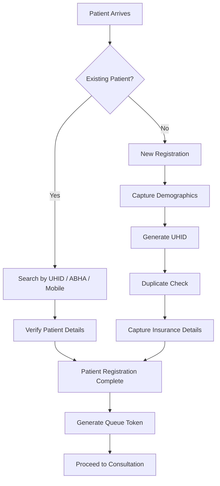

# 🏥 Patient Registration & Identity Management (PRD-01)

A Product Requirements Document (PRD) for the Patient Registration & Identity Management module of a Hospital Information System.

---

## Patient Registration Workflow

---

## Repository Contents

| File | Description |
|------|-------------|
| Patient_Registration_Requirements.docx | Complete Product Requirements Document |
| README.md | Repository overview |

---

## Objectives

- Standardize patient registration
- Generate UHID
- Prevent duplicate patient records
- Support ABHA integration
- Capture insurance details
- Improve registration workflow

---

## Status

🚧 Under Development