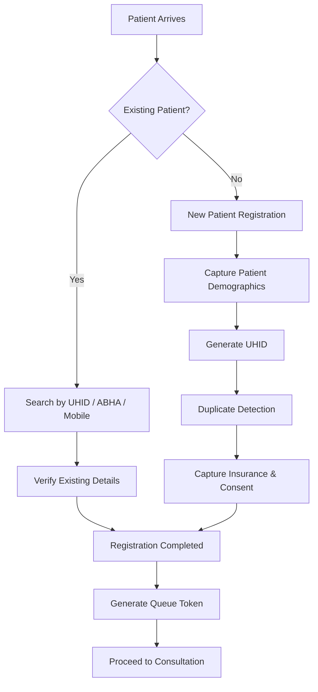

# 🏥 Patient Registration & Identity Management (PRD-01)

A comprehensive **Product Requirements Document (PRD)** for the **Patient Registration & Identity Management** module of a Hospital Information System (HIS).

This repository documents the business requirements, workflows, functional specifications, compliance requirements, and implementation roadmap for building a modern patient registration system aligned with Indian healthcare standards.

---

# 📖 Table of Contents

- Overview
- Problem Statement
- Project Goals
- Workflow
- Module Scope
- Key Functional Requirements
- Non-Functional Requirements
- System Integrations
- Compliance
- AI Features
- Repository Contents
- Future Roadmap
- References

---

# 📖 Overview

Patient Registration is the first interaction between a patient and the hospital.

This module establishes a reliable patient identity by generating a Unique Hospital ID (UHID), capturing demographic information, preventing duplicate records, and preparing patient information for downstream systems such as billing, EMR, laboratory, pharmacy, and national digital health platforms.

The module is designed as **PRD-01** of the **Hospital Operations Suite**.

---

# 🚨 Problem Statement

Many hospitals continue to rely on paper-based or semi-digital registration processes, resulting in:

- Duplicate patient records
- Missing or inconsistent demographic information
- Delays during registration
- Insurance verification issues
- Poor interoperability between hospital systems
- Limited integration with ABDM and ABHA

This PRD defines a standardized workflow to improve registration accuracy, speed, and compliance. :contentReference[oaicite:2]{index=2}

---

# 🎯 Project Goals

- Eliminate duplicate patient records
- Generate unique UHIDs
- Support ABHA integration
- Improve registration efficiency
- Capture complete patient demographics
- Enable future interoperability with Hospital Information Systems
- Ensure compliance with healthcare regulations :contentReference[oaicite:3]{index=3}

---

# 🏥 Patient Registration Workflow

---

# 📌 Module Scope

### Included

- OPD Registration
- IPD Registration
- Emergency Registration
- UHID Generation
- ABHA Verification
- Duplicate Detection
- Demographic Capture
- Insurance Details
- Consent Management
- Queue Token Generation
- Newborn Registration
- Unknown Patient Registration

### Excluded

- Electronic Medical Records
- Billing Engine
- Appointment Scheduling
- Digital Consent Management (Future Modules)

---

# ✨ Key Functional Requirements

The module supports:

- Unique Hospital ID generation
- Patient demographic capture
- ABHA creation and verification
- Duplicate patient detection
- Insurance and payer information
- Consent management
- Queue token generation
- Emergency registration workflow
- Offline registration support
- Self-registration support
- Health camp registration
- Audit trail and record merge workflows :contentReference[oaicite:4]{index=4}

---

# ⚙️ Non-Functional Requirements

The solution is designed to provide:

- High registration throughput
- High system availability
- Reliable audit logging
- Secure data storage
- Regulatory compliance
- Scalable deployment for hospitals of different sizes
- Graceful handling of ABDM service downtime :contentReference[oaicite:5]{index=5}

---

# 🔗 System Integrations

This module integrates with:

- ABDM Gateway
- ABHA Services
- PMJAY
- SMS / WhatsApp Gateway
- Billing System
- Electronic Medical Record (EMR)
- Hospital Information System (HIS)
- Queue Management System :contentReference[oaicite:6]{index=6}

---

# 📚 Standards & Compliance

The requirements are aligned with:

- DPDP Act 2023
- ABDM Guidelines
- Aadhaar Act 2016
- MoHFW EHR Standards
- NABH Standards
- Clinical Establishments Act
- BNSS 2023
- Information Technology Act 2000 :contentReference[oaicite:7]{index=7}

---

# 🤖 AI Features

Future enhancements include:

- AI-assisted duplicate record detection
- Voice-to-registration
- AI-generated DPDP notice simplification
- Intelligent data quality validation and suggestions :contentReference[oaicite:8]{index=8}

---

# 📂 Repository Contents

| File | Description |
|------|-------------|
| 📄 README.md | Repository overview |
| 📄 Patient_Registration_Requirements.docx | Complete Product Requirements Document |

---

# 🚀 Future Roadmap

- Duplicate Detection Engine
- Patient Self Registration
- Mobile Registration
- WhatsApp Registration
- AI-assisted Registration
- Bulk Health Camp Registration
- Offline Registration Mode

---

# 📄 Document Information

| Item | Value |
|------|-------|
| Module | PRD-01 |
| Project | Hospital Operations Suite |
| Version | 1.0 |
| Status | Draft |
| Repository | Patient Registration & Identity Management |

---

# ⭐ Repository Purpose

This repository serves as the official requirements documentation for the **Patient Registration & Identity Management** module and acts as a reference for future implementation and system design.

---